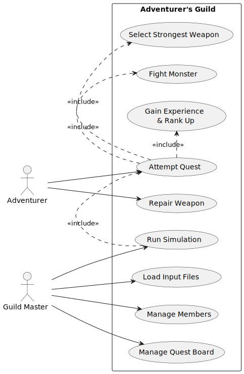
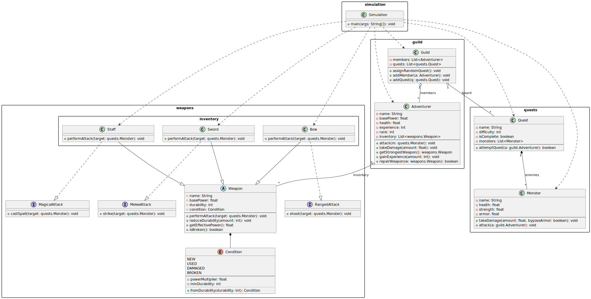
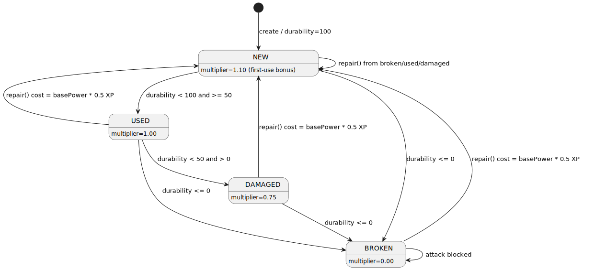
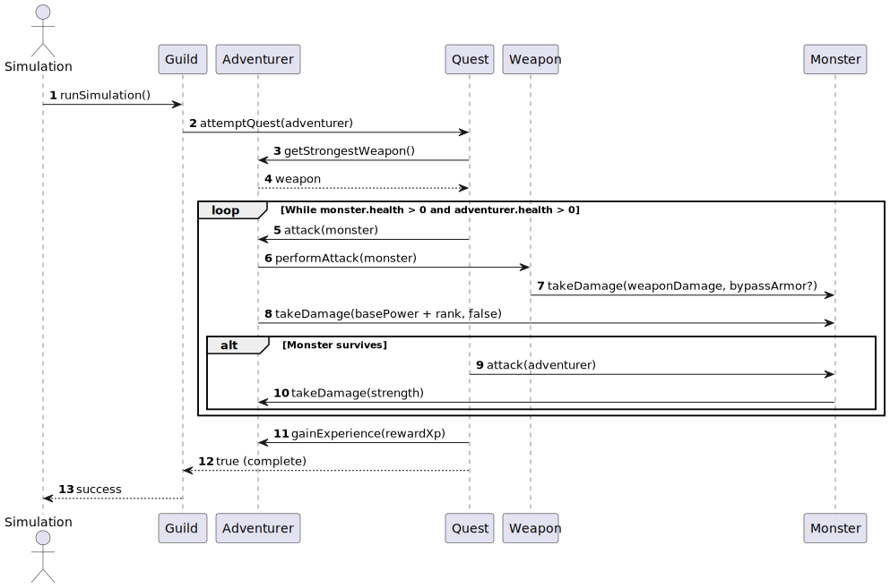
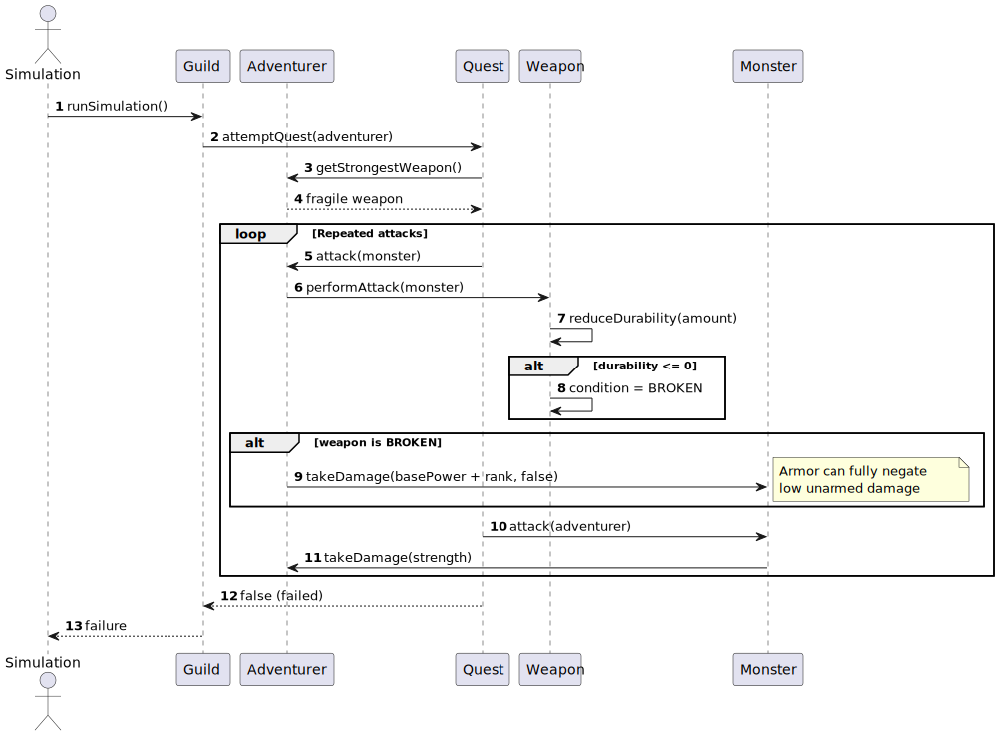

# Adventurer's Guild

In a world of adventure, a guild recruits adventurers to take on dangerous quests. Each adventurer arms themselves with weapons and faces formidable monsters to prove their strength. The guild manages members and a quest board, assigning adventurers to sequentially battle monsters.

* **Weapon Management**: Weapons (Swords, Bows, Staffs) have power boosts and durability.
* **State Lifecycle**: Weapons transition through **New**, **Used**, **Damaged**, and **Broken** states based on durability, affecting performance.
* **Combat Mechanics**: Damage is calculated using base power, rank, and weapon strength.
* **Progression**: Adventurers gain experience from defeated monsters, increasing their rank and power.
* **Repair Services**: Weapons can be restored to the New state by spending experience points.

## System diagrams

### Use case

The Use Case diagram illustrates the interactions between the **Adventurer** (Player), the **Guild Master** (System/Simulation), and the core functionalities like attempting quests, repairing weapons, and managing inventory.



### Class

The system architecture follows an object-oriented design:

* **Abstract Weapon**: Parent to `Sword`, `Bow`, and `Staff`.
* **Entities**: `Adventurer`, `Monster`, `Guild`, and `Quest`.
* **Enum**: `Condition` (State) manages the 100%, 75%, and 0% power multipliers.

The class diagram is package-aware (`simulation`, `weapons`, `weapons.inventory`, `quests`, `guild`) and includes `Simulation` dependencies.



### State

1. **New**: 100% durability, includes a 10% first-use bonus.
2. **Used**: 50–99% durability, standard performance.
3. **Damaged**: 1–49% durability, 75% power boost.
4. **Broken**: 0% durability, unusable.
5. **Repair**: A transition from any state back to **New** via experience expenditure.


## Scenarios

### Successful quest completion

This sequence models an adventurer equipping their strongest weapon, engaging in turn-based combat with a monster, dealing damage based on monster armor, gaining experience, and ranking up after the final victory.



### Equipment failure

This sequence demonstrates the mid-battle degradation of a weapon. As durability falls below 50% (Damaged) or reaches 0 (Broken), the power boost drops, potentially causing the adventurer to fail the quest if they cannot overcome the monster's armor.



## Implementation details

### Technical specifications

* Javadoc comments are included for all classes and non-getter/setter methods.
* Unit tests (JUnit) are provided for core logic (Combat calculation, Durability reduction, Enum state transitions).
* The simulation reads data from `simulation/data/adventurers.txt`, `simulation/data/weapons.txt`, `simulation/data/quests.txt`, and `simulation/data/monsters.txt`.

### Probabilistic logic

Per the assignment guidelines, the following rates were implemented:

* **Sword Critical**: 20% chance to double damage at the cost of 2× durability.
* **Staff Spell**: 25% chance to halve monster strength.
* **Repair Success**: Defined as a fixed cost of `Experience = Weapon Power * 0.5`.

## How to run

### Full verification

Runs tests, compiles sources, and executes the simulation in one flow.

```bash
mvn test && mvn compile && java -cp target/classes simulation.Simulation
```

### Tests only
```bash
mvn test
```
```bash
mvn -Dtest=QuestScenarioTest test
```

Run one test method only:

```bash
mvn -Dtest=QuestScenarioTest
```

### Compile only

```bash
mvn compile
```

### Simulation only

Build app classes and run simulation from the input files in project root:

```bash
mvn compile
java -cp target/classes simulation.Simulation
```

Input files used by simulation:
- `simulation/data/adventurers.txt`
- `simulation/data/weapons.txt`
- `simulation/data/quests.txt`
- `simulation/data/monsters.txt`

### Clean rebuild

Removes generated output and rebuilds everything:

```bash
mvn clean test compile
```