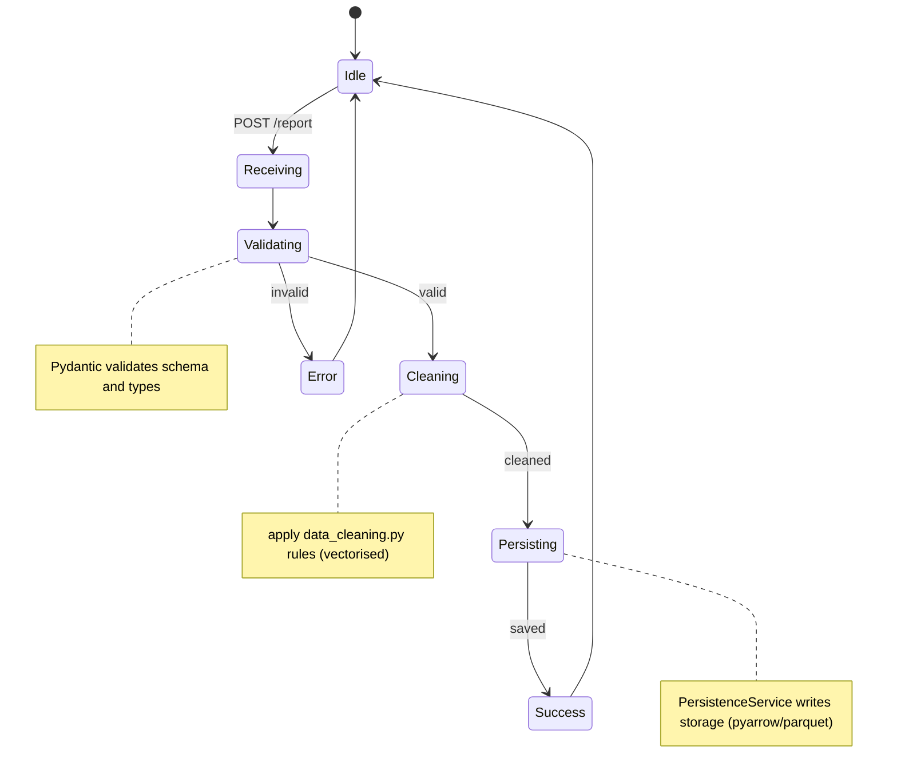
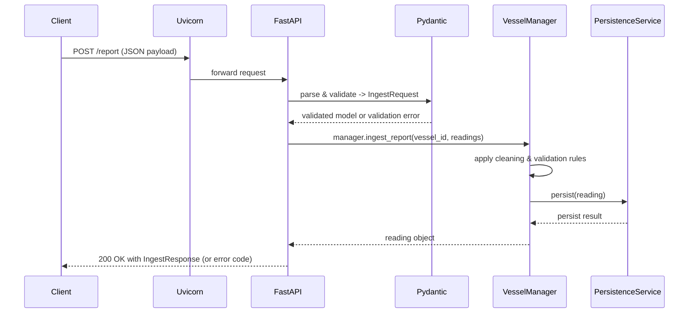

# Project Poseidon

Enterprise-grade backend for maritime vessel traffic monitoring.

Project Poseidon ingests AIS-like telemetry from authorised vessels and provides a real-time fleet risk map, system
health tracking, and historical time-series views. Built with modern Python tooling, it serves as a robust API and
visualisation layer for maritime operations teams, traffic coordinators, and safety analysts.

* **Core:** Python 3.13+, FastAPI, Uvicorn, Pydantic v2
* **Data Handling:** pandas, pyarrow
* **Visualisation:** Plotly 6
* **Tooling:** uv (dependency management), pytest, httpx, ruff, mypy

### Table of Contents

* [Architecture](#architecture)
* [Getting started](#getting-started)
* [API endpoints and usage](#api-endpoints-and-usage)
* [Development and testing](#development-and-testing)
* [Lessons learnt](#lessons-learnt)
* [Future changes](#future-changes)

## Architecture

At startup, the application loads configuration and authorised vessel data, initialises a `PersistenceService` and
`VesselManager`, and loads cleaned historical data into memory.



When a telemetry report is submitted via `POST /report`, the payload is strictly validated against a Pydantic model (
`IngestRequest`). The `VesselManager` then checks if the vessel is authorised, applies vectorised data cleaning rules
via pandas, and persists the reading. The visual endpoints return standalone HTML documents with embedded Plotly charts
for immediate interactivity without requiring a separate frontend.



## Getting started

### 1. Installation

Ensure you have Python 3.13+ installed.

```bash
# Sync dependencies
uv sync
```

### 2. Generate historical data

Before running the server, generate the base historical telemetry data (131,400 rows spanning one year for 15 vessels).
This step enforces realistic bounds for speed, draft, heading, and fuel.

```bash
uv run python data_generator.py
```

### 3. Run the server

Start the application using the provided shell script or directly via Uvicorn:

```bash
# Using the script
chmod +x run.sh
./run.sh

# Or directly with Uvicorn
PYTHONPATH=src uv run uvicorn poseidon.main:app --reload
```

The server will be available at `http://0.0.0.0:8000/`.

## API endpoints and usage

Once the server is running, you can explore the endpoints in your browser or via the terminal. Validation is handled at
the API boundary (Pydantic DTOs), keeping domain objects framework-independent.

### Core

* `GET /` - Welcome page with quick links.
* `GET /docs` - Auto-generated Swagger UI documentation.
* `GET /status` - System health and counters.
* `GET /map` - Interactive real-time map (Plotly `px.scatter_map`).
* `GET /history/{vessel_id}` - 4-trace hourly time-series with a range slider.
* `GET /distribution/{year}/{month}` - 100% stacked bar chart by flag state.

### Telemetry ingestion

`POST /report` - Submit new telemetry readings.

```bash
curl -X POST http://0.0.0.0:8000/report \
  -H "Content-Type: application/json" \
  -d '{
    "vessel_id": "vessel_rotterdam_001",
    "readings": {
      "speed_knots": 18.4,
      "draft_m": 11.2,
      "heading_deg": 274,
      "fuel_rate_lph": 310
    }
  }'
```

## Development and testing

Run the following commands to ensure code integrity before pushing:

```bash
# Run unit tests
uv run pytest

# Linting and formatting
uv run ruff check src tests
uv run ruff format src tests

# Static type checking
uv run mypy src
```

### How the server handles a request

When you send data (a JSON payload) to `/report`, FastAPI routes it to a function that expects an `IngestRequest`.
Pydantic checks if the data matches this structure (e.g., ensuring `speed_knots` is a number). If it's incorrect, it
immediately returns an error. If correct, the `VesselManager` cleans the data, checks if the vessel is allowed in our
system, and saves it using the `PersistenceService`.

## Lessons learnt

Building this system presented several valuable engineering challenges:

* Historical telemetry is often noisy. Designing vectorised, defensible cleaning rules in `data_cleaning.py` and
  deciding what to drop versus what to fix took careful consideration.
* Pydantic v2 is incredibly safe, but it requires precise DTO (Data Transfer Object) design to avoid friction when
  real-world inputs are slightly off-spec.
* Ensuring cross-platform compatibility with `pyarrow` on Python 3.13 emphasised the importance of rigorous dependency
  management with `uv`.

## Future changes

* Add API key/JWT authentication for the `/report` endpoint.
* Migrate from file-based persistence to a PostgreSQL backend for better scalability.
* Implement comprehensive end-to-end (E2E) tests that exercise the HTTP layer and persistence simultaneously.