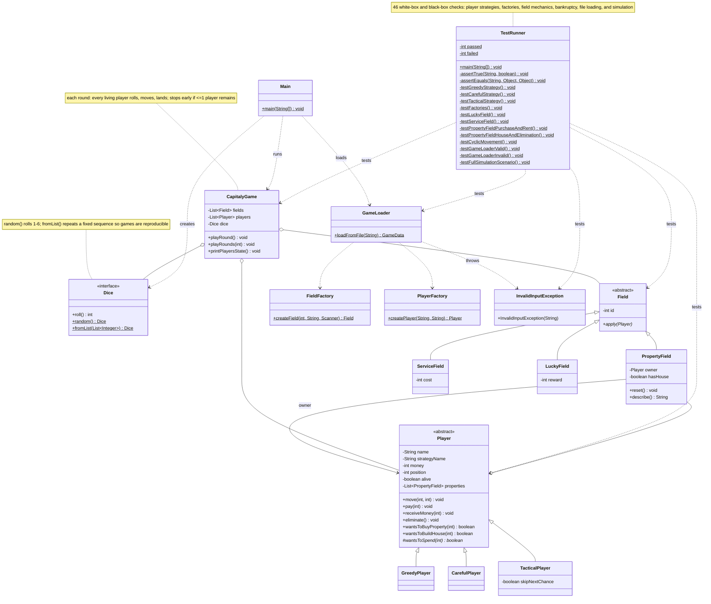
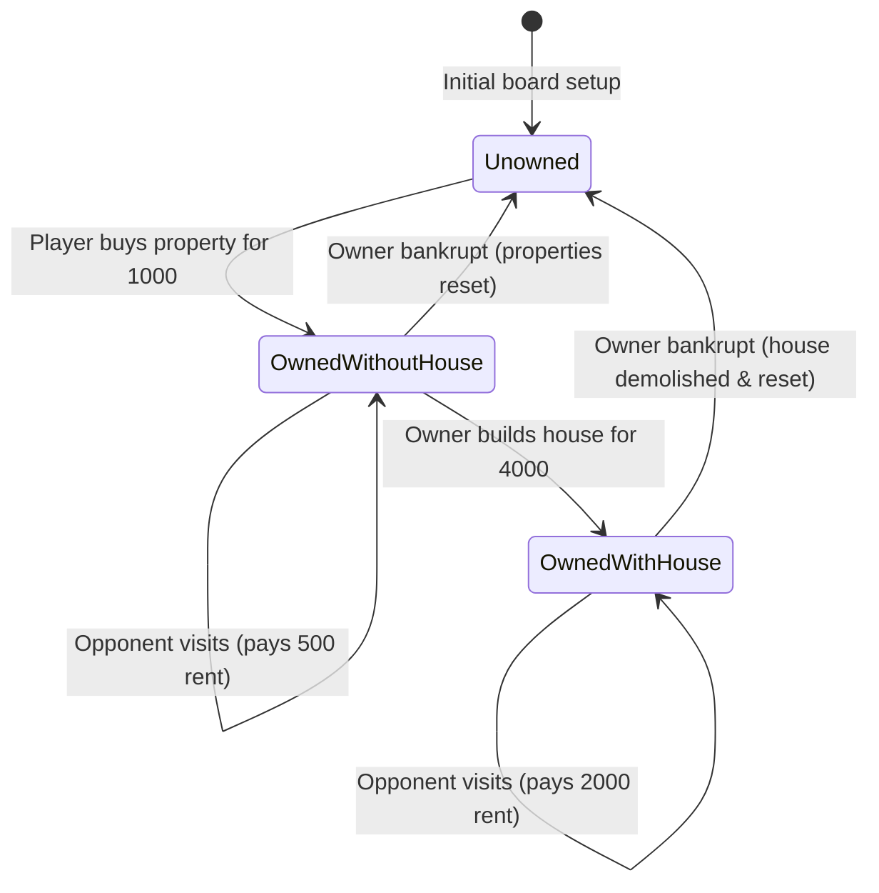
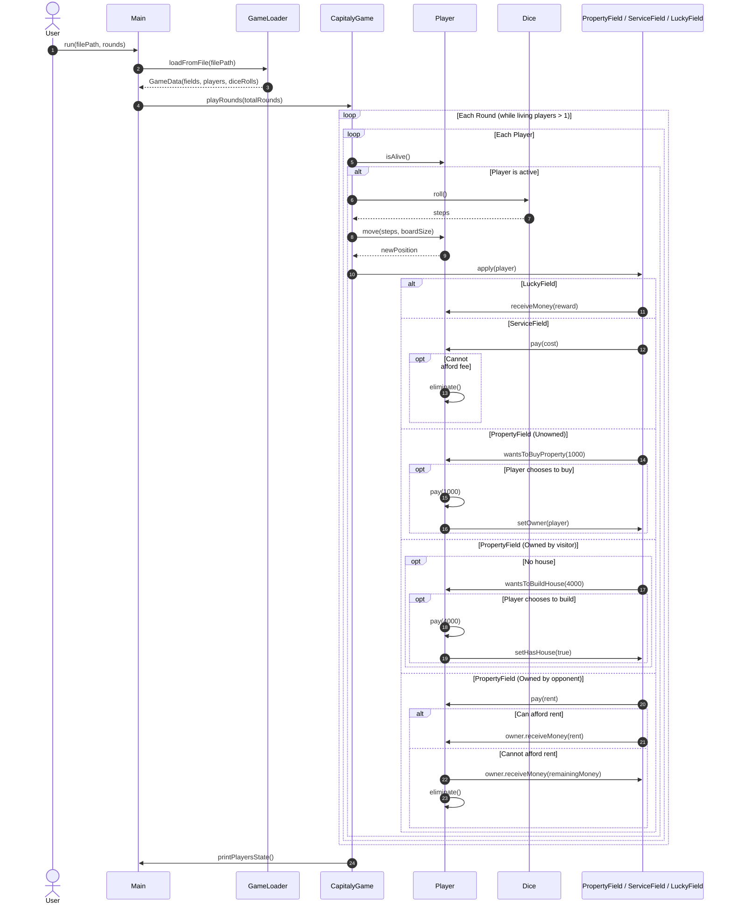

# Capitaly Simulation

## Task

A simplified Capitaly board game on a cyclic track of fields. Three field types:

- **Property** — if unowned, the player may buy it for 1000. If the player already owns it and it has no house, they may build one for 4000. If another player owns it, the visitor pays rent: 500 without a house, 2000 with one.
- **Service** — the player pays a fixed fee to the bank.
- **Lucky** — the player receives a fixed reward from the bank.

Every player starts at position 0 with 10000. Each round, every living player rolls the dice and moves forward. What a player buys depends on its strategy:

- **Greedy** — buys and builds whenever it can afford it.
- **Careful** — buys or builds only if the cost is at most half of its current balance.
- **Tactical** — skips every second opportunity it could afford.

A player who cannot pay a fee or rent goes bankrupt: their properties become unowned again (houses demolished) and they stop playing. The program runs a given number of rounds, then prints each player's strategy, status, balance, position, and properties.

## Design

OOP principles:
- **Encapsulation** — all state is private; other classes go through methods (`pay`, `receiveMoney`, `eliminate`), and `getProperties()` returns an unmodifiable list.
- **Abstraction** — `Field` and `Player` are abstract; `Dice` is an interface.
- **Inheritance** — `PropertyField`/`ServiceField`/`LuckyField` extend `Field`; `GreedyPlayer`/`CarefulPlayer`/`TacticalPlayer` extend `Player`.
- **Polymorphism** — the game iterates over `Field` and `Player` without knowing concrete types; `apply()` and `wantsToSpend()` dispatch to the right implementation. Each player subclass implements its own buying rule.

Patterns:
- **Factory** — `FieldFactory` and `PlayerFactory` turn input tokens into objects and reject unknown types, keeping construction out of `GameLoader`.
- `Dice` is a functional interface: `Dice.random()` rolls 1–6; `Dice.fromList(...)` cycles a fixed sequence so games can be reproduced and tested.

`GameLoader` reads and validates the input file (fields, players, optional dice rolls) and throws `InvalidInputException` on malformed data.

## Class diagram



## State machine diagram

### Property field lifecycle



## Sequence diagram

The following sequence illustrates a single simulation round in `CapitalyGame`, highlighting movement and polymorphic interaction with fields:



## Testing

`TestRunner` contains 46 checks and exits non-zero on failure.

White-box:
- Each player type's buying rules at different balances, including tactical's alternating skip.
- Factory creation of every field type and player type, including argument parsing.
- Property mechanics: buying, rent payment, house building, upgraded rent, and bankruptcy (remaining balance goes to the owner, properties reset).
- Service fee deduction and bankruptcy on an unaffordable fee; lucky field payout.

Black-box:
- Board wrap-around via modulo movement.
- File loading: a valid file, a missing file (`FileNotFoundException`), and an unknown field type (`InvalidInputException`).
- A full multi-round game on `sample_bankruptcy.txt` with fixed dice, checking final balances.

## Build and Run

All compilation and execution is handled via `run.sh`:

```bash
./run.sh                          # Compiles & runs default game (sample_game.txt, 5 rounds)
./run.sh <file_path> <rounds>     # Compiles & runs custom input file and rounds
./run.sh test                     # Compiles & runs the test suite
./run.sh build                    # Compiles without running
./run.sh clean                    # Cleans the compiled classes (bin/)
```
