# Capitaly Simulation

## Task

A simplified Capitaly board game on a cyclic track of fields. Three field types:

- **Property** — if unowned, the player may buy it for 1000. If the player already owns it and it has no house, they may build one for 4000. If another player owns it, the visitor pays rent: 500 without a house, 2000 with one.
- **Service** — the player pays a fixed fee to the bank.
- **Lucky** — the player receives a fixed reward from the bank.

Every player starts at position 0 with 10000. Each round, every living player rolls the dice and moves forward. What a player buys depends on its strategy:

- **Greedy** — buys and builds whenever it can afford it.
- **Careful** — buys or builds only if the cost is at most half of its current balance.
- **Tactical** — skips every second opportunity it could afford.

A player who cannot pay a fee or rent goes bankrupt: their properties become unowned again (houses demolished) and they stop playing. The program runs a given number of rounds, then prints each player's strategy, status, balance, position, and properties.

## Design

OOP principles:
- **Encapsulation** — all state is private; other classes go through methods (`pay`, `receiveMoney`, `eliminate`), and `getProperties()` returns an unmodifiable list.
- **Abstraction** — `Field` and `Player` are abstract; `Dice` is an interface.
- **Inheritance** — `PropertyField`/`ServiceField`/`LuckyField` extend `Field`; `GreedyPlayer`/`CarefulPlayer`/`TacticalPlayer` extend `Player`.
- **Polymorphism** — the game iterates over `Field` and `Player` without knowing concrete types; `apply()` and `wantsToSpend()` dispatch to the right implementation. Each player subclass implements its own buying rule.

Patterns:
- **Factory** — `FieldFactory` and `PlayerFactory` turn input tokens into objects and reject unknown types, keeping construction out of `GameLoader`.
- `Dice` is a functional interface: `Dice.random()` rolls 1–6; `Dice.fromList(...)` cycles a fixed sequence so games can be reproduced and tested.

`GameLoader` reads and validates the input file (fields, players, optional dice rolls) and throws `InvalidInputException` on malformed data.

## Class diagram

```mermaid
classDiagram
    class Dice {
        <<interface>>
        +roll() int
        +random()$ Dice
        +fromList(List~Integer~)$ Dice
    }
    note for Dice "random() rolls 1-6; fromList() repeats a fixed sequence so games are reproducible"

    class Field {
        <<abstract>>
        -int id
        +apply(Player)*
    }
    class PropertyField {
        -Player owner
        -boolean hasHouse
        +reset() void
        +describe() String
    }
    class ServiceField {
        -int cost
    }
    class LuckyField {
        -int reward
    }

    class Player {
        <<abstract>>
        -String name
        -String strategyName
        -int money
        -int position
        -boolean alive
        -List~PropertyField~ properties
        +move(int, int) void
        +pay(int) void
        +receiveMoney(int) void
        +eliminate() void
        +wantsToBuyProperty(int) boolean
        +wantsToBuildHouse(int) boolean
        #wantsToSpend(int)* boolean
    }
    class GreedyPlayer
    class CarefulPlayer
    class TacticalPlayer {
        -boolean skipNextChance
    }

    class CapitalyGame {
        -List~Field~ fields
        -List~Player~ players
        -Dice dice
        +playRound() void
        +playRounds(int) void
        +printPlayersState() void
    }
    note for CapitalyGame "each round: every living player rolls, moves, lands; stops early if <=1 player remains"

    class GameLoader {
        +loadFromFile(String)$ GameData
    }
    class FieldFactory {
        +createField(int, String, Scanner)$ Field
    }
    class PlayerFactory {
        +createPlayer(String, String)$ Player
    }

    Field <|-- PropertyField
    Field <|-- ServiceField
    Field <|-- LuckyField
    Player <|-- GreedyPlayer
    Player <|-- CarefulPlayer
    Player <|-- TacticalPlayer
    Player o-- PropertyField
    PropertyField --> Player : owner
    CapitalyGame o-- Field
    CapitalyGame o-- Player
    CapitalyGame o-- Dice
    GameLoader ..> FieldFactory
    GameLoader ..> PlayerFactory
```



## Methods

`Field` and subclasses
- `getId()` — field index on the board.
- `apply(player)` — what happens when the player lands here (purchase/rent/house for `PropertyField`, fee for `ServiceField`, reward for `LuckyField`).
- `PropertyField.reset()` — clears owner and house after the owner goes bankrupt.
- `PropertyField.describe()` — short label like `Field #3 [House]`, used when listing owned properties.

`Player` (abstract) and subclasses
- `GreedyPlayer`, `CarefulPlayer`, `TacticalPlayer` — each implements `wantsToSpend(price)` with its own rule (afford it / at most half the balance / skip every second chance).
- `getName()`, `getStrategyName()`, `getMoney()`, `getPosition()`, `isAlive()`, `getProperties()` — state accessors.
- `move(steps, boardSize)` — advances cyclically: `(pos + steps) % boardSize`.
- `pay(amount)` / `receiveMoney(amount)` — updates the balance.
- `eliminate()` — marks the player bankrupt and resets all owned properties.
- `wantsToBuyProperty(price)` / `wantsToBuildHouse(price)` — both delegate to `wantsToSpend`.

`FieldFactory` / `PlayerFactory`
- `createField(id, type, scanner)` — builds the right `Field` for the type token; reads the extra integer for service/lucky fields.
- `createPlayer(name, strategyType)` — builds the right `Player` subclass for the type token.

`Dice`
- `roll()` — next roll value.
- `random()` / `fromList(list)` — random rolls, or a fixed sequence that repeats.

`CapitalyGame`
- `playRound()` — one turn per living player: roll, move, apply field.
- `playRounds(totalRounds)` — repeats `playRound`, stopping early if one or zero players remain.
- `printPlayersState()` — prints the final state of every player.

`GameLoader`
- `loadFromFile(filePath)` — parses the input file into fields, players, and optional dice rolls. Throws `FileNotFoundException` or `InvalidInputException`.

## Testing

`TestRunner` contains 46 checks and exits non-zero on failure.

White-box:
- Each player type's buying rules at different balances, including tactical's alternating skip.
- Factory creation of every field type and player type, including argument parsing.
- Property mechanics: buying, rent payment, house building, upgraded rent, and bankruptcy (remaining balance goes to the owner, properties reset).
- Service fee deduction and bankruptcy on an unaffordable fee; lucky field payout.

Black-box:
- Board wrap-around via modulo movement.
- File loading: a valid file, a missing file (`FileNotFoundException`), and an unknown field type (`InvalidInputException`).
- A full multi-round game on `sample_bankruptcy.txt` with fixed dice, checking final balances.

Build and run:

```
javac -d bin src/capitaly/*.java src/capitaly/*/*.java
java -cp bin capitaly.TestRunner
java -cp bin capitaly.Main sample_game.txt 5
```
