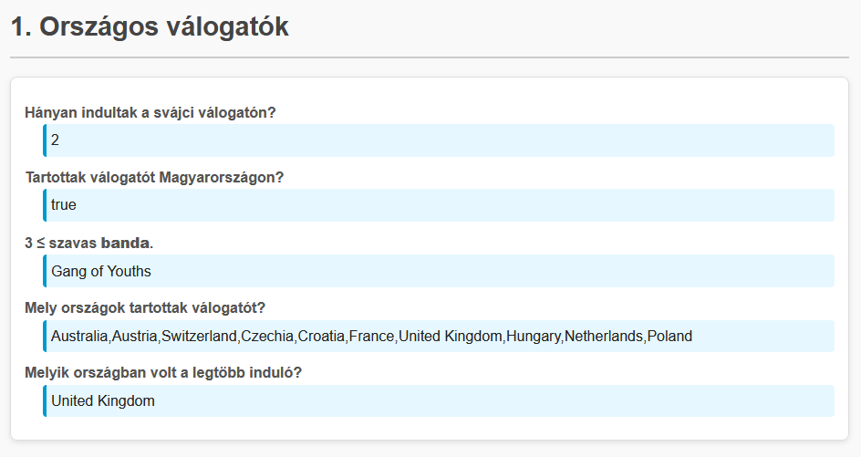
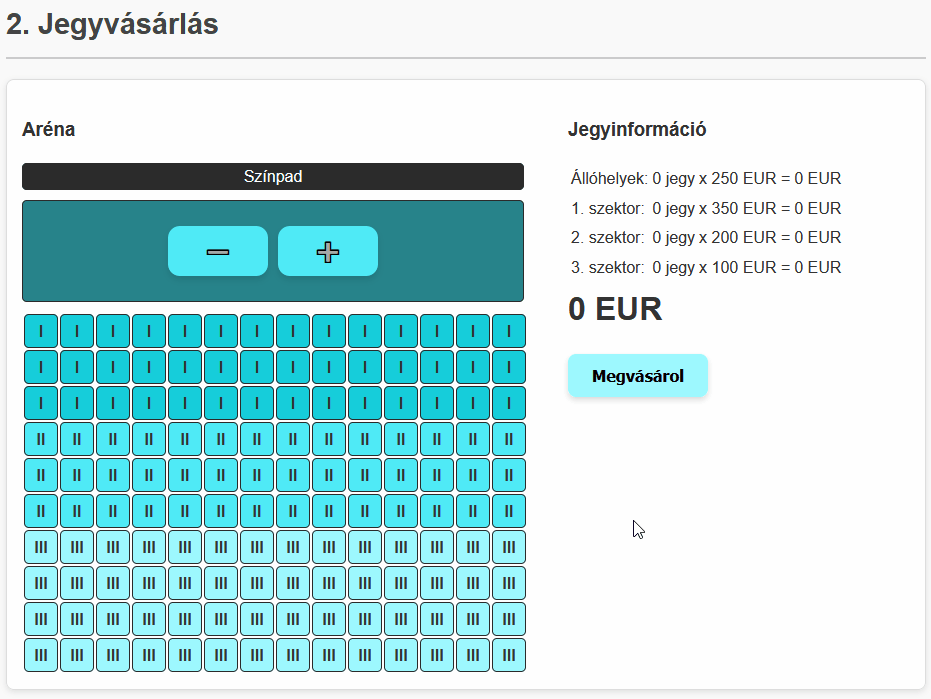
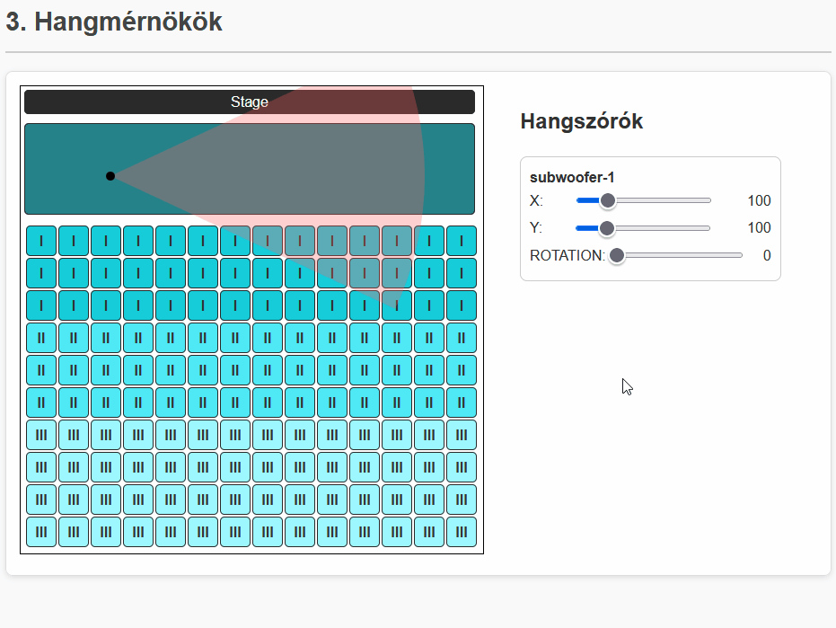
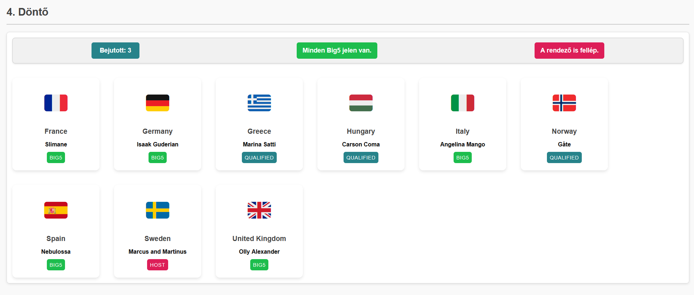
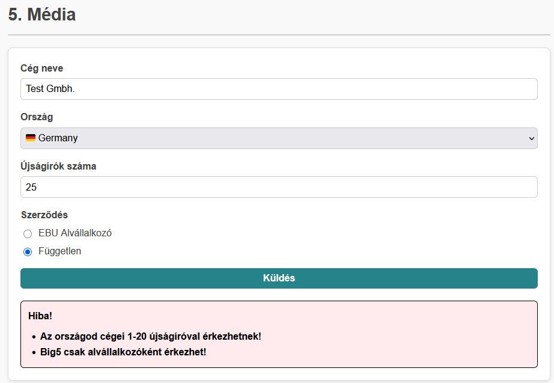
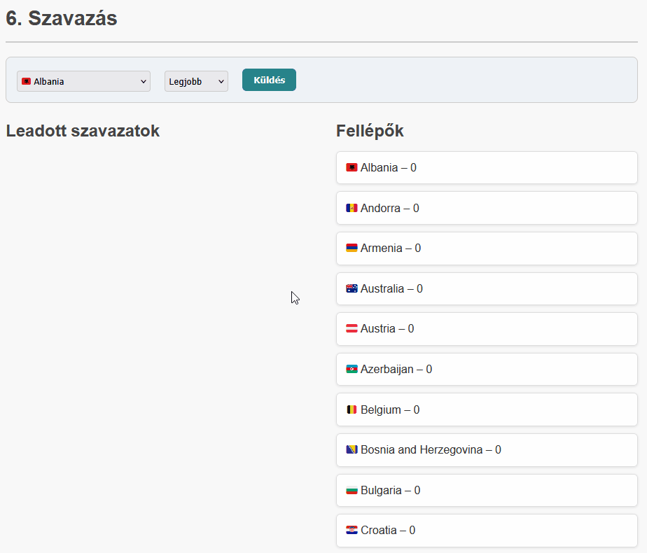

# Exam

## Information

### Until when can I write it?
- The midterm exam can be written **until 19:30**, which **includes** not only solving the tasks but also: downloading the initial files; filling out the `README` file (which is **mandatory** – without it, the solution is **incomplete**); compressing and uploading the final solution. **No additional time** will be granted afterward.
- Tasks must be submitted via the [Exam System](https://webprogramozas.inf.elte.hu/zh). The system closes exactly at 19:30. In the **last 10 minutes** of the exam, focus **only on compressing and uploading** your work! A failed last-minute upload will result in a failing grade just the same.

### What can I use?
- The materials you pre-uploaded to the [Exam System](https://webprogramozas.inf.elte.hu/zh).
- [JavaScript documentation](https://developer.mozilla.org/en-US/).
- [PHP documentation](https://www.php.net/).
- The [lecture slides](https://webprogramozas.inf.elte.hu/webprog/lectures-pdf-en/).

### What can’t I use?
Among others:
- Human assistance (synchronous, asynchronous, chat, forum, etc.), except for asking help from supervising teachers.
- Artificial intelligence (ChatGPT, Bing AI, GitHub Copilot, AI-based code completion/extensions in VS Code, etc.). Not knowing the features of your installed extensions **does not exempt you from consequences**.
If you are unsure whether something is allowed, **ask us instead**.

You must confirm your acceptance of all the above in the `README` file included in the starter package.

### What else should I know?
- The tasks (1, 2, 3…) are **independent** and can be solved **in any order**. Subtasks (a, b, c...) within a task may sometimes build on each other, or an earlier subtask might help in solving a later one – however, it's worth reading through all parts: even if you’re stuck on *a* or *b*, you might figure out *c-e*. Also, if you're stuck on a subtask, **don't spend an hour on it** – move on! The first few subtasks of the next task might be worth more points than the one you're stuck on.
- To begin, download the framework we’ve provided. Each task is in a separate folder. In each folder, we’ve prepared the HTML, CSS, JavaScript, and PHP files. Work in these! For client-side tasks, you'll usually only need to edit the `.js` file, but if necessary, you can modify the HTML as well, or even split your solution into multiple `.js` files – though this is **not required**.
- In the downloaded framework’s `README` file, enter your Neptun code and name! **We will not evaluate any solution that does not have a properly completed `README` file!**
- In each task folder, you'll find a `TASKS.md` file. Replace the space between `[ ]` with an `x` for each subtask you have (even partially) completed! This helps us know what to look at during evaluation.
- Be sure to install PHP on your machine: [Tóta Dávid’s installer](https://github.com/totadavid95/PhpComposerInstaller/blob/master/README_hu.md)

## Lore
Szombaton véget ért a 2025-ös Eurovíziós Dalfesztivál, melynek nyertese Ausztria, így a jövő évi verseny helyszíne előreláthatólag Bécs lesz. A szervezők már meg is keresték a híres ELTE IK-t, hogy az informatikai infrastruktúra maradéktalan állapotban várja a 2026-os évet.

The 2025 Eurovision Song Contest concluded on Saturday. The winner was Austria, who will now be the host of the next year's event. The organizers have already contacted the famous ELTE FI to prepare the best ever IT system for the 2026 contest.

## JavaScript tasks

### 1. National selections (js-1-selections, 10 pont)
Az Eurovízió válogatókat minden ország magának rendezi. Segíts az Eurovízió szervezőknek, hogy tudják, melyik országban mekkora volt a show! A feladatokat **ne beégetve oldd meg, hanem programozottan**, hiszen a szervezők még nem rendelkeznek a tényleges jövő évi indulók listájával!

The Eurovision selections are held on a national level - all nations organize it for themselves. Help the Eurovision staff by calculating metrics about the national selections. Solve the subtasks **with programming, not by writing the exact answer into the HTML**, because ofcourse next years actual contestants are not yet available, we can only work with sample data.

*In the `index.js` file you can access the `participants` variable, which was defined in `participants.js`; and the `nations` variable which was defined in `nations.js`. The `participants` array is ordered by countries.*

- a. (1 pt) How many participants attended the Swiss (`CHE`) national selection show? Write the answer into the element with `taskA` ID!
- b. (1 pt) Was there a Hungarian national selection show? (Same as: Is there a Hungarian participant?) Write the answer into the element with `taskB` ID!
- c. (2 pt) Find a band (`type`: `band`) whose name consists of atleast 3 words (Same as: Band that has two spaces in the name.)  Write the band's name into the element with `taskC` ID!
    - You can presume that it exists.
- d. (3 pt) List the nations which had a national selection show into the element with `taskD` ID! (Same as: List all nations from the `participants` array.)
    - Nation**codes** with duplicates: 1 pt
    - Nation**names** (`CHE` -> `Switzerland`): +1 pt
    - No duplicates (either code or name): +1 pt
- e. (3 pt) Which nation had the most participants? A Write the answer into the element with `taskE` ID!
    - Max select: 2 pt
    - Using nation**name** (`CHE` -> `Switzerland`): +1 pt



### 2. Ticket purchase (js-2-ticket, 15 pont)
The 2026 Eurovision will be held in a famous Austrian stadium. Ticket purchase is an especially crucial point of the event. The audience can buy tickets to 3 sectors; or in front of the stage, which is only standing places. All sectors have different prices.

- a. (1 pt) Write each ticket cost into the `#cost-info` table!
    - You have to put the values in the `#sectorCosts` array into the `#sector-0-cost`, `#sector-1-cost`, `#sector-2-cost`, `#sector-3-cost` elements.
    - Array indexes match the element's number (eg.: `0` -> `#sector-0-cost`).
- b. (1 pt) When clicking the plus button (`#add-standing`), increase the number of standing places in the `cost-info` azonosítójú table!
    - Write the number of tickets into the `sector-0-amount` element!
    - Calculate the price into the `#sector-0-total` element! (`total = amount * cost`)
    - Pressing the minus (`#sub-standing`) must work similarly (but with decrease); the amount/price can't go below 0!
- c. (3 pt) Generate the seats into the `#seating` table!
    - The seats are represented by 10 rows and 14 columns of `<td>` elements.
    - Apply the `seat` CSS class to each seat.
    - Apply the `sector-1` CSS class to the seats in the first 3 rows; `sector-2` to the seats in the next 3 rows; and `sector-3` to the rest of the seats! 
    - *If you can't solve this subtask, but want to try the rest, use the table in `seating.html` by inserting it into the `#seating` table.*
- d. (2 pt) Make the seats selectable!
    - If we click on a seat in the `#seating` table, apply the `selected` CSS class to it.
    - If we click an already selected seat, remove the class!
- e. (3 pt) Keep the selected seats always up-to-date in the `#cost-info` table!
    - Update the number and price of selected seats!
    - All seat should update it's respective sector correctly!
    - If we deselect a seat, the numbers in the table should go down!
- f. (1 pt) Keep the total cost up-to-date (`#total` element)!
- g. (2 pt) We can finish the transaction by pressing the `#purchase` button.
    - A `cost-info` táblát és a `total` végösszeget állítsd alaphelyzetbe!
    - Set the values in the `#cost-info` table back to the starting state!
    - Apply the `taken` CSS class to selected seats and remove the `selected` CSS class from them!
- h. (1 pt) A taken seat can not be selected again (but the rest can be; and they too can be marked taken by a purchase)!



### 3. Soundengineer (js-3-soundengineer, 11 pont)
One of the most important technicians of Eurovision might be the soundengineers, because a concert can be ruined even by a bit imperfection in sound.

*You don't have to write the engine in the code, we have provided that. Your task is only to fill up the `drawScene` and `drawSpeaker` functions so that the model is displayed on the screen.`*

Help: `context.arc(x, y, r, start, end)` function.
```js
// x, y: Coordinates of the circle's center
// r: Radius of the circle
// start, end: The starting and ending angle of the arc/section/segment in radians. E.g.: 0, Math.PI, 2*Math.PI

context.arc(0, 0, 15, 0, Math.PI) // This is a half circle (circular sector) of 15 radius with it's center in the (0,0) point. A full curcle would be 2 pi radians.
```

- a. (1 pt) `drawScene`: Delete the content of the `canvas` element every time this function is called.
- b. (1 pt) `drawScene`: Draw the `backgroundImage` into position `(0,0)` on the `canvas` element each time the function is called. (This will be the background.)
- c. (1 pt) `drawSpeaker`: Draw a filled black dot (with a radius of 5) into position `(x,y)` using the `x` and `y` parameters!
    - If you did it well, the subwoofer-1 sliders will already move ir around.
- d. (1 pt) `drawSpeaker`: Draw another circle into `(x,y)`. The color is red this time and the radius is the `range` parameter's value.
    - If the red circle hides the black dot, don't be scared, just switch the order of drawing.
    - The black dot will be the center of the red circle.
    - The red circle will mainly be out of frame, that's alright.
- e. (3 pt) `drawSpeaker`: The red circle should not be a full circle, only a circular sector/segment of it. The `cone` and `rotation` parameters will help with this.
    - The start of the arc would be at `(rotation - cone / 2) * pi`, but we have to divide it by `180` to convert between degrees and radians.
    - The end of the arc is the same, but we add the `cone / 2`, not subtract it.
    - If you did everything right, you don't yet have a nice circular sector ("cone"), only the tip, a circular segment.
- f. (2 pt) `drawSpeaker`: Starting from point `(x,y)` draw the entire circular sector ("cone").
    - *If you couldn't solve subtask e., you can just draw a triangle here, but then comment out the red circle so your solution stays readable!*
    - You might want to use the `beginPath`, `moveTo`, `arc`, and `closePath` functions after one another.
    - If you did it right, the nice circular sector ("cone") is visible now.
- *It is time to change the `simpleMode` variable in line 8 to `false`!*
- g. (2 pt) `drawSpeaker`: Useing the `type` parameter, draw the circular sector ("cone") in different colors!
    - `subwoofer`: `rgba(255, 100, 100, 0.3)`
    - `midrange`: `rgba(100, 255, 100, 0.3)`
    - `tweeter`: `rgba(100, 100, 255, 0.3)`



## PHP tasks

### 4. Döntő (php-4-final, 10 pont)
There are 3 ways to get into the Eurovision final.
1. The host has a spot automatically.
2. France, Germany, Italy, Spain and the UK all have a spot automatically.
3. Everyone else has to qualify through the selections.
Help the viewers understand the contestants in the final!

*Use the elements in the starting code as a base for how your solution should look like. If you are finished, delete the starting cards!*

- a. (1 pt) List as many `div` elements with `card` CSS class into the `#main` element, as the number of contestants!
- b. (1 pt) Write the flag, country and contestant name into the respective `.flag`, `h2` and `.contestant` elements in the cards!
- c. (1 pt) Write into the `.method` element on each card why that contestant is in the final: `big5`, `qualified` or `host`.
- d. (2 pt) Apply the respective CSS class (`big5`, `qualified`, `host`) onto each card.
- e. (1 pt) How many contestants are in the final through qualifying? (Same as: How many contestans are of `qualified` method?) Write the answer into the `#information > #qualified` element!
- f. (1 pt) Are all Big5 nations participating? Write `All Big5 present.` if yes, `Missing Big5!` if no into the `#information > #big5` element.
    - *You can presume that the data is correct and no fake values or duplicates exist - it's enough to check the count of big5s.*
- g. (1 pt) Will the host participate? Write `The host will participate.` if yes; `The host will not participate!` if no into the `#information > #host`element!
- h. (2 pt) Sort the cards in alphabetical order based on the nation's name!
    - *You might want to use the `usort` and `strcmp` functions together.*



### 5. Press registration (php-5-media, 12 pont)
Even though big media companies already have a contract with the organizers, smaller businesses, news outlets like to send reporters as well. They have to register through a form.

*Validate the form data after sending on server side! (So do not use HTML/JS validation, write it in PHP!)* **Full points are only granted if the respective error message is displayed. Otherwise only half the subtask point can be obtained!** *You don't hace to use the `#errors` div, you can show the errors in any way, eg. writing it right after the input fields, but when first loading the page, no error message should appear! You might want to complete the error handling and state consistency at the start, it will help you on the long run.*

- a. (2 pt) All fields are required.
- b  (1 pt) The company name is atleast 3 characters.
- c. (1 pt) The nation can only be from the list (`$nations` variable).
- d. (1 pt) The number of reporters should be a whole number (Not text, not decimal.)
- e. (1 pt) The number of reporters should be at least 1 and at most 10.
- f. (1 pt) In case of a Big5 country (`'GBR', 'ITA', 'ESP', 'DEU', 'FRA'`), number of reporters can go up to 20.
- g. (1 pt) The contract can only be `subsidiary` or `independent`.
- h. (1 pt) For Big5 yountries the contract must be `subsidiary`.
- i. (2 pt) The form is state consistent / keeps it's values when coming beck with errors.
- j. (1 pt) The `#success` element should only be displayed in case of a perfectly fille

Error messages (not mandatory to use these, but spares some time):
```
The company name field is mandatory!
Selecting a nation is mandatory!
The number of reporters field is mandatory!
Selecting the type of contract is mandatory!
The name of the company should be at least 3 letters!
Unknown nation!
The number of reportes should be a whole number!
Companies from your nation can regiter 1-10 reporters!
Companies from your nation can regiter 1-20 reporters!
Unknown contract type!
Big5 can only be a subsidiary!
```



### 6. Vote (php-6-vote, 14 pont)
One of the most exciting parts of Eurovision is the voting... but that is over. Now it's time to administer the votes into the system, which is even more exciting! The (significantly simplified) point awarding method goes like this:
- Vites are either "Best", "Very good", or "Good".
- Each "Best" vote is worth 12 points, each "Very good" 8 points, and each "Good" 5 points.

Help the organizers by creating the vote administrator system!

- a. (2 pt) Administering a vote should be saved into a file.
    - You don't have to check the form data, you can presume it is filled correctly.
    - After saving the data, redirect back to the original main page.
- b. (2 pt) List the votes in the file onto the page (based on the examples in the HTML code)!
- c. (3 pt) Have an option to delete votes!
- d. (3 pt) Calculate the points of the contestants (nations)!
    - Each "Best" is worth 12 points.
    - Each "Very good" is worth 8 points.
    - Each "Good" is worth 5 points.
    - *You don't have to store this in a file, but you can if you want to.*
- e. (1 pt) List the result of your calculations in subtask d.!
    - *It doesn't matter if you list nations/contestants with 0 points or you don't.*
- f. (3 pt) Sort the nations/contestants in decreasing order by sum points.
    - *You might want to use the `usort` function.*

