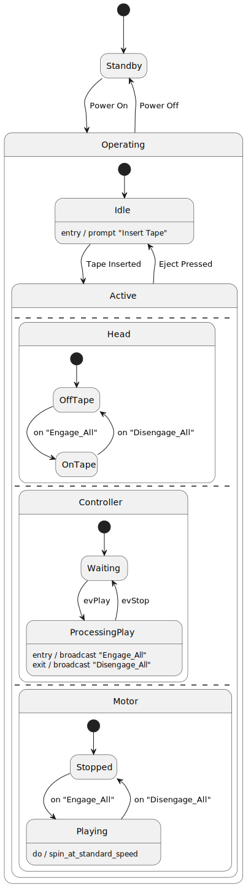
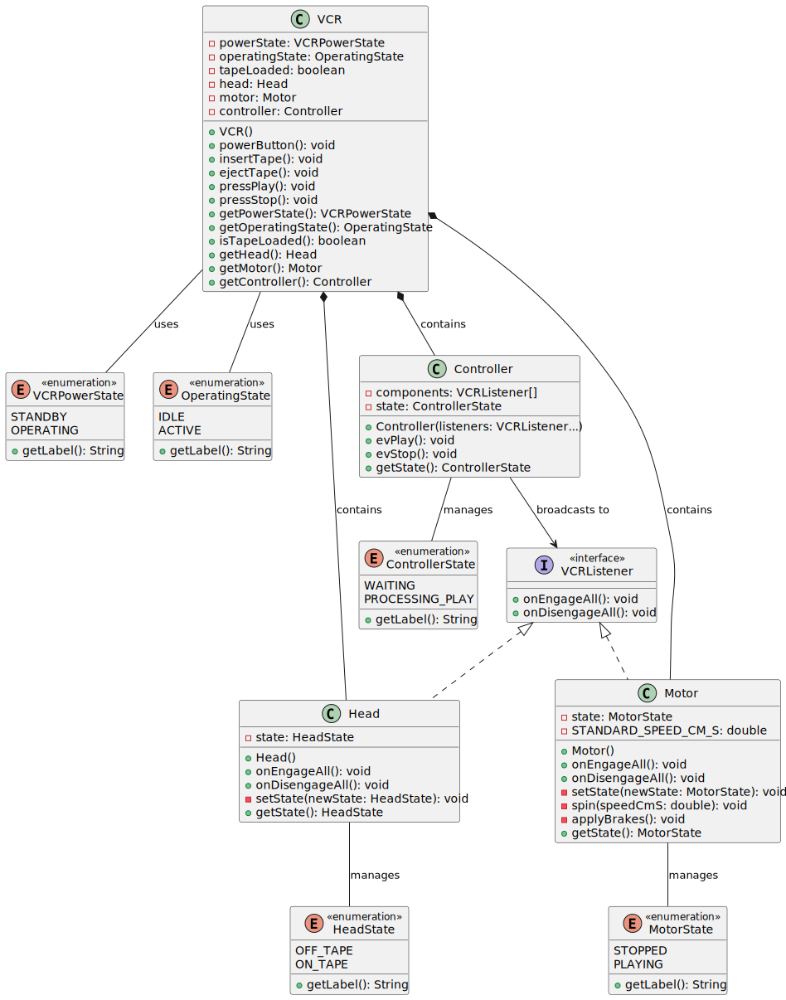
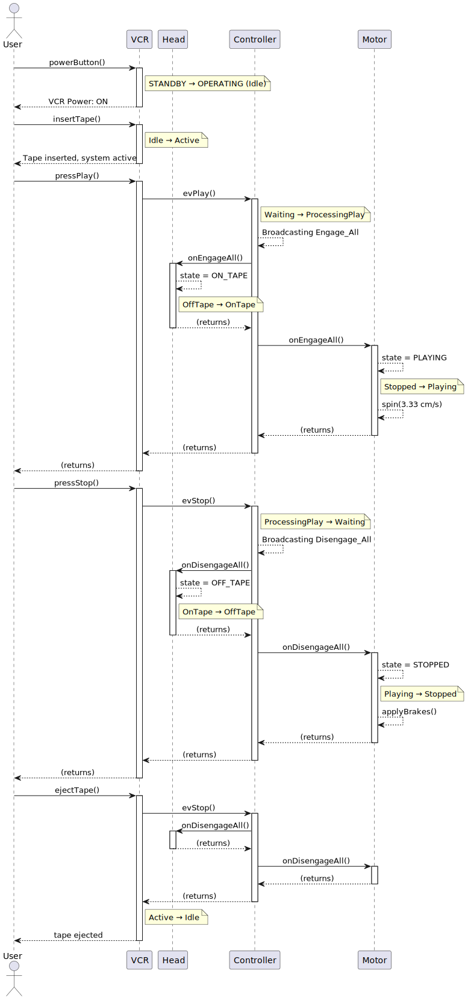

# VCR Project - Reorganized Structure

This project implements a Video Cassette Recorder (VCR) state machine.

### Package

```text
com.vcr
├── VCR.java                    # Main VCR machine (context)
├── state/
│   ├── VCRPowerState.java     # Power states: STANDBY, OPERATING
│   └── OperatingState.java    # Operating states: IDLE, ACTIVE
├── component/
│   ├── Head.java              # Tape head component (OffTape/OnTape)
│   └── Motor.java             # Motor component (Stopped/Playing)
├── controller/
│   └── Controller.java        # Event broadcaster (coordinates components)
└── event/
    └── VCRListener.java       # Event interface for components
```

### State transitions

```text
[*] → Standby
     ↓ (Power On)
Operating → Idle (initially)
     ↓ (Tape Inserted)
   Active
     ├ Head: OffTape → OnTape (on Engage_All)
     ├ Motor: Stopped → Playing (on Engage_All)
     └ Controller: Waiting → ProcessingPlay
     ↓ (Stop/Eject)
   Idle
     ↓ (Power Off)
Standby
```

## Design pattern: Observer + state machine

1. **VCR.java** - Context class managing:
   - Power state (STANDBY ↔ OPERATING)
   - Operating state (IDLE ↔ ACTIVE when tape is loaded)
   - User interactions (power, insert tape, play, stop, eject)

2. **Controller.java** - Event broadcaster:
   - Broadcasts `Engage_All` on Play
   - Broadcasts `Disengage_All` on Stop
   - Coordinates all components

3. **Components:**
   - **Head.java** - Transitions between OffTape/OnTape based on events
   - **Motor.java** - Transitions between Stopped/Playing based on events

4. **State Enums:**
   - VCRPowerState: Controls overall VCR power
   - OperatingState: Manages Idle/Active states when powered
   - Component-specific states: HeadState, MotorState, ControllerState

### State UML

<figure>
  
  <figcaption>State diagram — power and operating substates, parallel regions, and broadcasts.</figcaption>
</figure>

### Class UML

<figure>
  
  <figcaption>Class diagram — components, interfaces, enums, and relationships.</figcaption>
</figure>

### Sequence

<figure>
  
  <figcaption>Sequence diagram — typical user interactions and event broadcasting flow.</figcaption>
</figure>

## Usage

```java
VCR myVCR = new VCR();
myVCR.powerButton();        // STANDBY → OPERATING (Idle)
myVCR.insertTape();         // Idle → Active
myVCR.pressPlay();          // Broadcasts Engage_All
myVCR.pressStop();          // Broadcasts Disengage_All
myVCR.ejectTape();          // Active → Idle
myVCR.powerButton();        // OPERATING → STANDBY
```
